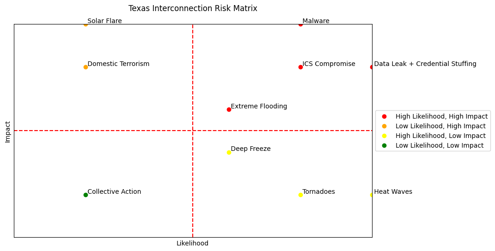

# CAI 5200 Risk Matrix

An example of how I used Chat GPT, Python, and Jupyter Notebook to create visuals for CAI 5200: Threats and Resilience.

You can edit this example to suit your particular project if you have a basic grasp of Python.

Requirements:

* [Jupyter Notebook](https://jupyter.org/)
* [matplotlib](https://matplotlib.org/)

